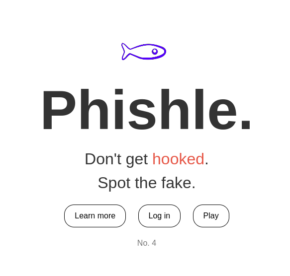
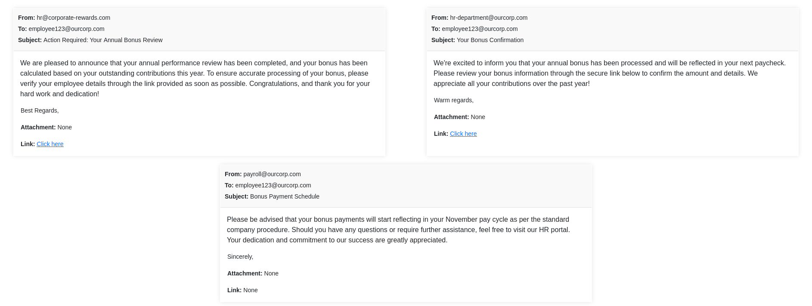

# Project Name
In the era of constant cyber threats, phishing remains a top vector for security breaches. From Corporations to individuals, there is a critical need to enhance digital literacy and awareness towards phishing among internet users. Introducing, Phishle, web-based application designed to educate and train users in the art of phishing detection. Drawing inspiration from wordle, a popular puzzle game, Phishle tries to engage the user through this game-like experience. Users are presented with sets of emails, tasked to distinguish between legitimate communications and phishing attempts, with immediate feedback and explanations provided to reinforce learning points




# How to run
- Download the latest zip from the Release section on the right on GitHub.  
- Extract the file to desired location
- Install python (pip is included in latest versions by default)

```
python --version 

```
- Install required python libraries
```
pip install -r requirements.txt

```
- Set up mySQL database with the following credentials
```
username: phishle
password: phishlepasswd
database: phishle_database

```
- Get a GPT 4T api key from [openAI.com] (openai.com)
- Put the API key in the empty space in the api.py file
```
openai.api_key = ' '

```
- Run generate_emails.py to generate emails 
- Run app.py to start the flask backend
- Navigate to the folder in CLI and start a http test server

``` 
python3 -m http.server
```
- Open chrome and go to localhost:8000 and navigate to the index.html


# How to contribute
Follow this project board to know the latest status of the project: [https://trello.com/b/7VEbUrnu/phishle](https://trello.com/b/7VEbUrnu/phishle)  

### How to build
- Use this github repository: [https://github.com/cis3296s24/Phishle/]
- Specify main branch to use for a more stable release or for cutting edge development.  
- Check requirements.txt for library to download if needed 
- Target app.py to run the flask backend, generate_emails.py for emails, and index.html
- When run, you should see the index.html page.

